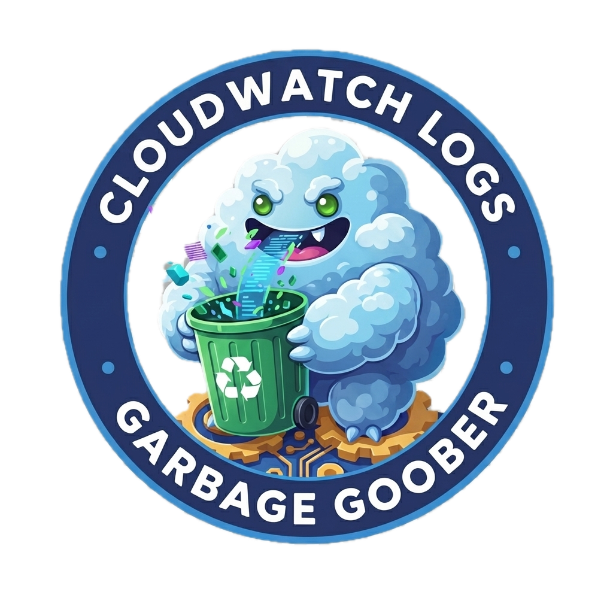

<!-- markdownlint-disable MD033 -->

# CloudWatch Logs Garbage Goober

<p align="center">
  
</p>

Automated cleanup of CloudWatch Log Groups based on configurable patterns and tags.

## Overview

This CDK application automatically schedules and executes deletion of CloudWatch Log Groups that match configurable patterns. Instead of letting log groups accumulate indefinitely, this solution:

1. Detects when matching log groups are created (based on name patterns and tags)
2. Schedules their deletion based on retention settings plus a configurable delay
3. Deletes them automatically after the scheduled time

## Architecture

```txt
┌─────────────────┐     ┌──────────────┐     ┌─────────────────┐
│   CloudTrail    │────▶│  EventBridge │────▶│  Event Handler  │
│ CreateLogGroup  │     │     Rule     │     │     Lambda      │
└─────────────────┘     └──────────────┘     └────────┬────────┘
                                                      │
                                                      ▼
                                             ┌─────────────────┐
                                             │   EventBridge   │
                                             │    Scheduler    │
                                             └────────┬────────┘
                                                      │
                                      (retention + deletionDelayDays)
                                                      │
                                                      ▼
┌─────────────────┐     ┌──────────────┐     ┌─────────────────┐
│   CloudWatch    │◀────│   Deletion   │◀────│   SQS Queue     │
│   Log Group     │     │   Handler    │     │                 │
│   (deleted)     │     │   Lambda     │     └─────────────────┘
└─────────────────┘     └──────────────┘              │
                                                      │ (on failure)
                                                      ▼
                                             ┌─────────────────┐
                                             │      DLQ        │
                                             └─────────────────┘
```

## Configuration

Create your configuration file from the template:

```bash
cp config.json.template config.json
```

Then edit `config.json` with your settings:

```json
{
  "appName": "CWLogsGarbageGoober",
  "logGroupPatterns": [
    "/aws/lambda/MyApp-",
    "/aws/lambda/TestService-"
  ],
  "requiredTags": {
    "Environment": "test"
  },
  "deletionDelayDays": 1,
  "alertsEmailParameter": "/alerts-email"
}
```

> **Note:** `config.json` is git-ignored to allow environment-specific configurations.

### Configuration Options

| Option                 | Description                                         | Default                                 |
| ---------------------- | --------------------------------------------------- | --------------------------------------- |
| `appName`              | Prefix for all AWS resource names of this service   | `CWLogsGarbageGoober`                   |
| `logGroupPatterns`     | Log group name prefixes to match                    | Powertools e2e patterns                 |
| `requiredTags`         | Tags that must be present on CreateLogGroup event   | `Service: Powertools-for-AWS-e2e-tests` |
| `deletionDelayDays`    | Days to wait after retention period before deleting | `1`                                     |
| `alertsEmailParameter` | SSM parameter name containing alert email           | `/alerts-email`                         |

### CDK Context Overrides

You can override any config option at deploy time using CDK context:

```bash
# Override app name
cdk deploy -c appName="MyLogGroupCleaner"

# Override log group patterns (JSON array)
cdk deploy -c logGroupPatterns='["/aws/lambda/MyApp-", "/custom/logs/"]'

# Override required tags (JSON object)
cdk deploy -c requiredTags='{"Environment":"staging","Team":"platform"}'

# Override deletion delay
cdk deploy -c deletionDelayDays=7
```

## Event Flow

1. **Detection**: An EventBridge Rule listens for `CreateLogGroup` CloudTrail events matching:
   - Log group names starting with patterns defined in `logGroupPatterns`
   - Tags matching all key-value pairs in `requiredTags`

2. **Scheduling**: The Event Handler Lambda:
   - Fetches the log group's retention settings
   - Creates an EventBridge Scheduler one-time schedule to fire after `retention + deletionDelayDays` (in UTC)
   - The schedule auto-deletes after execution

3. **Deletion**: When the schedule fires:
   - A message is sent to the SQS deletion queue
   - The Deletion Handler Lambda processes messages in batches
   - Log groups are deleted via the CloudWatch Logs API
   - Already-deleted log groups are handled gracefully (idempotent)

4. **Failure Handling**:
   - Failed deletions are retried up to 3 times
   - Persistent failures go to the Dead Letter Queue (DLQ)
   - CloudWatch Alarms notify via email when issues occur

## Prerequisites

- Node.js v22.18.0 or later
- AWS CLI configured with appropriate credentials
- An SSM Parameter storing the alert email address

Create the SSM parameter before deploying:

```bash
aws ssm put-parameter \
  --name "/alerts-email" \
  --type "String" \
  --value "your-email@example.com" \
  --description "Email address for CloudWatch alarm notifications"
```

## Deployment

```bash
# Install dependencies
npm ci

# Deploy the stack
npm run cdk deploy
```

After deployment, **confirm the SNS subscription** by clicking the link in the confirmation email.

## Monitoring & Alerting

The stack includes CloudWatch Alarms that send email notifications:

| Alarm                              | Trigger             | Description                                         |
| ---------------------------------- | ------------------- | --------------------------------------------------- |
| `{appName}-DLQ-Messages`           | >= 1 message in DLQ | Permanent deletion failures requiring investigation |
| `{appName}-EventHandler-Errors`    | >= 1 error in 5 min | Event handler Lambda errors                         |
| `{appName}-DeletionHandler-Errors` | >= 1 error in 5 min | Deletion handler Lambda errors                      |

## Development

```bash
# Run tests (watch mode)
npm test

# Run tests once with coverage
npm test -- run --coverage

# Lint and format
npm run lint:fix

# Synthesize CloudFormation template
npm run cdk synth

# Compare deployed stack with current state
npm run cdk diff
```

## AWS Resources Created

| Resource          | Name Pattern                      | Purpose                                |
| ----------------- | --------------------------------- | -------------------------------------- |
| Lambda            | `{appName}-event-handler`         | Processes CreateLogGroup events        |
| Lambda            | `{appName}-deletion-handler`      | Deletes log groups from SQS messages   |
| SQS Queue         | `{appName}-deletion-queue`        | Queues deletion tasks                  |
| SQS Queue         | `{appName}-deletion-dlq`          | Dead letter queue for failed deletions |
| EventBridge Rule  | `{appName}-Rule`                  | Captures CreateLogGroup events         |
| SNS Topic         | `{appName}-alerts`                | Alarm notifications                    |
| IAM Role          | `{appName}-publish-to-queue-role` | Allows Scheduler to send to SQS        |
| CloudWatch Alarms | `{appName}-*`                     | Operational monitoring                 |

## License

MIT-0
