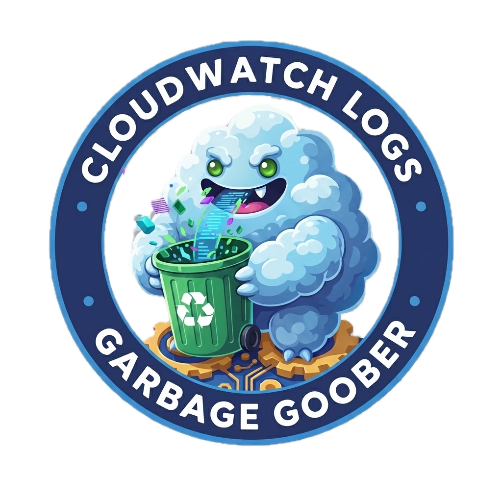

<!-- markdownlint-disable MD033 -->

# CloudWatch Logs Garbage Goober

<p align="center">
  
</p>

Automated cleanup of CloudWatch Log Groups based on configurable patterns and tags.

## Overview

This CDK application automatically schedules and executes deletion of CloudWatch Log Groups that match configurable patterns. Instead of letting log groups accumulate indefinitely, this solution:

1. Detects when matching log groups are created (based on name patterns and tags)
2. Schedules their deletion based on retention settings plus a configurable delay
3. Deletes them automatically after the scheduled time

## Architecture

```txt
┌─────────────────┐     ┌──────────────┐     ┌─────────────────┐     ┌──────────────┐
│   CloudTrail    │────▶│  EventBridge │────▶│   SQS Queue     │────▶│  Event DLQ   │
│ CreateLogGroup  │     │     Rule     │     │ (Buffer, +5min) │     │ (on failure) │
└─────────────────┘     └──────────────┘     └────────┬────────┘     └──────────────┘
                                                       │
                                                       ▼
                                              ┌─────────────────┐
                                              │  Event Handler  │
                                              │     Lambda      │
                                              │ (Batch Process) │
                                              └────────┬────────┘
                                                       │
                                                       ▼
                                              ┌─────────────────┐
                                              │   EventBridge   │
                                              │    Scheduler    │
                                              └────────┬────────┘
                                                       │
                                       (retention + deletionDelayDays)
                                                       │
                                                       ▼
┌─────────────────┐     ┌──────────────┐     ┌─────────────────┐
│   CloudWatch    │◀────│   Deletion   │◀────│   SQS Queue     │
│   Log Group     │     │   Handler    │     │   (Deletion)    │
│   (deleted)     │     │   Lambda     │     └─────────────────┘
└─────────────────┘     └──────────────┘              │
                                                       │ (on failure)
                                                       ▼
                                              ┌─────────────────┐
                                              │  Deletion DLQ   │
                                              └─────────────────┘
```

### Single-Region Scope

**The stack only cleans up log groups in the region it is deployed to.** CloudTrail records
`CreateLogGroup` in the region the API call was made in and delivers the event to the default event
bus of _that_ region, so the EventBridge rule — which exists only in the deployment region — never
sees log groups created elsewhere. Matching log groups in other regions are simply never scheduled
for deletion.

To cover more regions, **deploy the stack once per region**. Each deployment is independent and
watches only its own region. Use a distinct `appName` per region, since IAM role names are
account-wide: two deployments in the same account sharing an `appName` would both try to create
`{appName}-publish-to-queue-role` and the second one would fail. The IAM permissions granted to the
handlers are scoped to the stack's own region accordingly.

## Configuration

Create your configuration file from the template:

```bash
cp config.json.template config.json
```

Then edit `config.json` with your settings:

```json
{
  "appName": "CWLogsGarbageGoober",
  "logGroupPatterns": [
    "/aws/lambda/MyApp-",
    "/aws/lambda/TestService-"
  ],
  "requiredTags": {
    "Environment": "test"
  },
  "deletionDelayDays": 1,
  "fallbackRetentionDays": 7,
  "slackWebhookParameter": "/slack-cloudwatch-alerts-webhook-url"
}
```

> **Note:** `config.json` is git-ignored to allow environment-specific configurations.

### Configuration Options

| Option                  | Description                                                    | Default                                 |
| ----------------------- | -------------------------------------------------------------- | --------------------------------------- |
| `appName`               | Prefix for all AWS resource names of this service              | `CWLogsGarbageGoober`                   |
| `logGroupPatterns`      | Log group name prefixes to match                               | Powertools e2e patterns                 |
| `requiredTags`          | Tags required at creation (see [below](#tag-filtering-caveat))  | `Service: Powertools-for-AWS-e2e-tests` |
| `deletionDelayDays`     | Days to wait after retention period before deleting            | `1`                                     |
| `fallbackRetentionDays` | Retention assumed for log groups that never expire (see below) | `7`                                     |
| `slackWebhookParameter` | SSM parameter name containing Slack workflow webhook URL       | `/slack-cloudwatch-alerts-webhook-url`  |

> **Note:** the webhook parameter is expected to be encrypted with the AWS-managed `aws/ssm` key,
> which needs no extra permissions to decrypt. If you encrypt it with a customer managed key, the
> stack must also grant the notifier function `kms:Decrypt` on that key ARN.

### Tag Filtering Caveat

`requiredTags` filters the tags recorded in the CloudTrail `CreateLogGroup` event. Only tags passed
in that API call can match; adding required tags later does not trigger another match, so the log
group is never scheduled for cleanup.

- **Matched:** CloudFormation/CDK-created log groups when the required tags are passed at creation
- **Not matched:** Lambda-service log groups created automatically without tags, even if tagged later
- **Not matched:** `aws logs create-log-group` followed by `aws logs tag-resource`

### CDK Context Overrides

You can override any config option at deploy time using CDK context. CLI context values arrive as strings, so array and object options must use valid JSON syntax as shown below; malformed values fail synthesis. The [`requiredTags` creation-time limitation](#tag-filtering-caveat) also applies to context overrides.

```bash
# Override app name
cdk deploy -c appName="MyLogGroupCleaner"

# Override log group patterns (JSON array)
cdk deploy -c logGroupPatterns='["/aws/lambda/MyApp-", "/custom/logs/"]'

# Override required tags (JSON object)
cdk deploy -c requiredTags='{"Environment":"staging","Team":"platform"}'

# Override deletion delay
cdk deploy -c deletionDelayDays=7

# Override the fallback retention used for never-expire log groups
cdk deploy -c fallbackRetentionDays=14
```

## Retention Handling

CloudTrail records `CreateLogGroup` **before** the retention policy is applied: tools like
CloudFormation and the AWS SDK call `PutRetentionPolicy` as a separate, subsequent API call. Reading
the retention immediately after the creation event would therefore often see no retention at all,
and scheduling a deletion off that would delete log groups almost immediately.

Two mechanisms prevent premature deletion:

- **Delivery delay**: the event processing queue delays each message by **5 minutes**, so the event
  handler only looks up the retention after `PutRetentionPolicy` has had time to land. The deletion
  date is still computed from the original CloudTrail `eventTime`, so the delay does not shift the
  effective deletion date.
- **Fallback retention**: if the log group still has no retention when the event is processed (it is
  set to _never expire_, or the retention was applied unusually late), the handler assumes
  `fallbackRetentionDays` instead of `0` days and logs a warning. Deletion is then scheduled for
  `eventTime + fallbackRetentionDays + deletionDelayDays`. The default of `7` days is applied even
  when the option is absent from `config.json`.

> **Note:** log groups matched by this stack are expected to be short-lived, e2e-test log groups.
> Never-expire log groups are still deleted, just after the fallback period. Increase
> `fallbackRetentionDays` if you need a longer grace period.

## Event Flow

1. **Detection**: An EventBridge Rule listens for `CreateLogGroup` CloudTrail events matching:
   - Log group names starting with patterns defined in `logGroupPatterns`
   - Tags matching all key-value pairs in `requiredTags`

   Only events from the deployment region reach the rule (see
   [Single-Region Scope](#single-region-scope))

2. **Buffering**: Events are sent to an SQS queue for throttling protection and batch processing.
   The queue delays delivery by 5 minutes so that the log group's retention policy, which is applied
   after the creation event, is visible to the handler (see [Retention Handling](#retention-handling))

3. **Scheduling**: The Event Handler Lambda processes SQS messages in batches (up to 10 at once):
   - Fetches each log group's retention settings, falling back to `fallbackRetentionDays` when the
     log group has no retention policy
   - Skips schedule creation successfully when a log group has already been deleted
   - Creates EventBridge Scheduler one-time schedules to fire after `retention + deletionDelayDays` (in UTC)
   - Records the log group's creation time in the scheduled message, so the deletion handler can tell
     which incarnation of the log group the schedule was created for
   - Schedules auto-delete after execution
   - Failed events are retried up to 3 times before going to DLQ

4. **Deletion**: When schedules fire:
   - Messages are sent to the SQS deletion queue
   - The Deletion Handler Lambda processes messages in batches
   - Each log group is looked up before deletion: if it was deleted and recreated with the same name
     after the schedule was created (its creation time is newer than the scheduled one), the deletion
     is skipped successfully so the new log group and its fresh logs are kept — the recreated log
     group has a schedule of its own
   - Log groups are deleted via the CloudWatch Logs API
   - Already-deleted log groups are handled gracefully (idempotent)

5. **Failure Handling**:
   - Failed deletions are retried up to 3 times
   - Persistent failures go to a Dead Letter Queue (DLQ)
   - Each queue has its own DLQ — `{appName}-event-processing-dlq` for creation events that could
     not be scheduled and `{appName}-deletion-dlq` for log groups that could not be deleted — so
     that messages redriven from a DLQ always go back to the queue they came from
   - CloudWatch Alarms notify via Slack when issues occur

## Prerequisites

- Node.js v22.18.0 or later
- AWS CLI configured with appropriate credentials
- A Slack Workflow Builder webhook URL stored in SSM Parameter

Create the SSM parameter before deploying:

```bash
aws ssm put-parameter \
  --name "/slack-cloudwatch-alerts-webhook-url" \
  --type "SecureString" \
  --value "https://hooks.slack.com/triggers/YOUR_WEBHOOK_URL" \
  --description "Slack Workflow Builder webhook for CloudWatch alarm notifications"
```

## Deployment

```bash
# Install dependencies
npm ci

# Deploy the stack
npm run cdk deploy
```

After deployment, **configure your Slack Workflow Builder** to receive the webhook notifications with the expected payload format.

The stack is deployed into a single region and only cleans up log groups there — see
[Single-Region Scope](#single-region-scope).

## Throttling Protection

The system includes built-in protection against AWS API throttling during high-volume events:

- **SQS Event Buffering**: EventBridge events are queued in SQS before Lambda processing
- **Batch Processing**: Lambda processes up to 10 events per invocation using AWS Lambda Powertools
- **Controlled Concurrency**: Maximum 10 concurrent Lambda executions prevent overwhelming AWS APIs
- **Adaptive Retry**: AWS SDK configured with adaptive retry mode and exponential backoff
- **Partial Failure Handling**: Failed events are retried individually without affecting successful ones
- **Dead Letter Queue**: Persistent failures are captured for investigation

This architecture prevents the "thundering herd" scenario that can occur during large-scale log group creation events.

## Monitoring & Alerting

The stack includes CloudWatch Alarms that send Slack notifications:

| Alarm                               | Trigger                   | Description                                                  |
| ----------------------------------- | ------------------------- | ------------------------------------------------------------ |
| `{appName}-Rule-FailedInvocations`  | >= 1 failed invocation    | EventBridge rule failed to deliver events to SQS             |
| `{appName}-DLQ-Messages`            | >= 1 message in DLQ       | Permanent deletion failures requiring investigation          |
| `{appName}-EventQueue-DLQ-Messages` | >= 1 message in DLQ       | Creation events that could not be scheduled for deletion     |
| `{appName}-EventHandler-Errors`     | >= 1 error in 5 min       | Event handler Lambda errors                                  |
| `{appName}-DeletionHandler-Errors`  | >= 1 error in 5 min       | Deletion handler Lambda errors                               |
| `{appName}-EventQueue-Depth`        | >= 50 messages for 10 min | Event processing queue backlog                               |
| `{appName}-EventQueue-MessageAge`   | >= 600 seconds for 10 min | Event processing delays (on top of the 5 min delivery delay) |

### Slack Payload Format

The Slack Workflow Builder webhook receives notifications with this payload:

```json
{
  "emoji": "🚨",
  "alarmName": "CWLogsGarbageGoober-DLQ-Messages",
  "alarmDescription": "Messages in the deletion DLQ indicate repeated deletion failures requiring investigation",
  "cloudWatchUrl": "https://eu-west-1.console.aws.amazon.com/cloudwatch/home?region=eu-west-1#alarmsV2:alarm/CWLogsGarbageGoober-DLQ-Messages",
  "region": "eu-west-1",
  "alarmTime": "2025-01-02 14:28:58 UTC",
  "appName": "CWLogsGarbageGoober"
}
```

## Development

```bash
# Run tests (watch mode)
npm test

# Run tests once with coverage
npm test -- run --coverage

# Lint and format
npm run lint:fix

# Synthesize CloudFormation template
npm run cdk synth

# Compare deployed stack with current state
npm run cdk diff
```

## AWS Resources Created

| Resource          | Name Pattern                        | Purpose                                            |
| ----------------- | ----------------------------------- | -------------------------------------------------- |
| Lambda            | `{appName}-event-handler`           | Processes CreateLogGroup events in batches         |
| Lambda            | `{appName}-deletion-handler`        | Deletes log groups from SQS messages               |
| Lambda            | `{appName}-slack-workflow-notifier` | Sends alarm notifications to Slack                 |
| SQS Queue         | `{appName}-event-processing-queue`  | Buffers CreateLogGroup events for batch processing |
| SQS Queue         | `{appName}-event-processing-dlq`    | Dead letter queue for unscheduled creation events  |
| SQS Queue         | `{appName}-deletion-queue`          | Queues deletion tasks                              |
| SQS Queue         | `{appName}-deletion-dlq`            | Dead letter queue for failed deletions             |
| EventBridge Rule  | `{appName}-Rule`                    | Captures CreateLogGroup events                     |
| IAM Role          | `{appName}-publish-to-queue-role`   | Allows Scheduler to send to SQS                    |
| CloudWatch Alarms | `{appName}-*`                       | Operational monitoring                             |

## License

MIT-0
